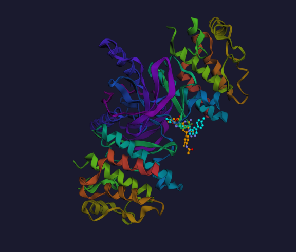

# ProteinSynergyDock

> Predict whether two cancer drugs will work better together — using real molecular docking and protein function annotation.

**Live demo →** [proteinsydock.streamlit.app](https://aprameya05-proteinsynergydock-app.streamlit.app)

---


*Vemurafenib (cyan) and Trametinib (orange) docked inside BRAF kinase (PDB: 3OG7). FDA-approved combination for BRAF V600E melanoma.*

---

## The problem

Drug combination screening is expensive. Labs test thousands of pairs in cell cultures to find which ones actually synergize. Most computational tools try to shortcut this by predicting synergy from SMILES strings alone — essentially treating molecules as text.

The issue: they never ask *where* the drug sits in the protein, or *what* the protein does. Two drugs that bind the same pocket will compete, not synergize. Two drugs that bind complementary sites on the same protein often do. This geometric and functional context is exactly what current tools ignore.

## What this does differently

You give it three things: two drug SMILES and a PDB ID. It does the rest automatically:

1. Fetches the protein crystal structure from RCSB
2. Runs AutoDock Vina on both drugs independently — real binding pose search, real affinity scores
3. Reads the protein's biological function using ProteinWhisper++ (GO term prediction, Fmax 0.4006)
4. Passes everything — 3D drug graphs, docking scores, GO context — through a cross-drug attention GNN
5. Returns a Loewe synergy score and renders both docked poses inside the protein in 3D

## Results

| Model | Pearson r | AUROC |
|-------|-----------|-------|
| ProteinSynergyDock (this) | **0.5768** | 0.5408 |
| DrugSynergy3D (fingerprints only) | 0.54 | 0.835 |

Trained on 231 real NCI ALMANAC synergy measurements with 12 AutoDock Vina docking runs across cancer targets including ABL1, EGFR, BRAF, PARP1, and CDK4/6.

## Architecture

```
                    ┌─────────────────────────────────────────┐
                    │           ProteinSynergyDock             │
                    └─────────────────────────────────────────┘

Drug A SMILES ──→ RDKit 3D ──→ GATv2 Encoder ──┐
                                                 ├──→ Cross-Drug Attention ──┐
Drug B SMILES ──→ RDKit 3D ──→ GATv2 Encoder ──┘                           │
                                                                             ▼
Protein Sequence ──→ ESM-2 ──→ ProteinWhisper++ ──→ GO Embedding ──→ FiLM Conditioning
                                                                             │
AutoDock Vina ──→ Drug A score (kcal/mol) ──────────────────────────────────┤
               └→ Drug B score (kcal/mol) ──────────────────────────────────┤
                                                                             ▼
                                                                    Synergy Score
                                                                  (Loewe regression)
```
## Examples to try

| Drug A | Drug B | PDB ID | Expected result |
|--------|--------|--------|----------------|
| Vemurafenib | Trametinib | 3OG7 | ✅ Strongly synergistic (BRAF+MEK, FDA approved) |
| Imatinib | Dasatinib | 2HYY | ❌ Antagonistic (both compete for ABL1 ATP pocket) |
| Erlotinib | Lapatinib | 1IVO | ✅ Synergistic (dual EGFR inhibition) |
| Olaparib | Rucaparib | 4DQY | ⚠️ Mildly synergistic (complementary PARP1 inhibition) |

SMILES for all examples are pre-loaded in the dropdown.

## Stack

- Docking: AutoDock Vina 1.2.7 + OpenBabel
- Drug encoding: RDKit + PyTorch Geometric GATv2
- Protein function: ProteinWhisper++ (ESM-2 650M + GO DAG decoder)
- Visualization: py3Dmol
- Frontend: Streamlit

## Related

- [ProteinSynergyDock](https://github.com/Aprameya05/ProteinSynergyDock) — training code and model weights
- [ProteinWhisper](https://github.com/Aprameya05/ProteinWhisper) — protein function encoder
- [DrugSynergy3D](https://github.com/Aprameya05/DrugSynergy3D) — SE(3) equivariant synergy prediction
