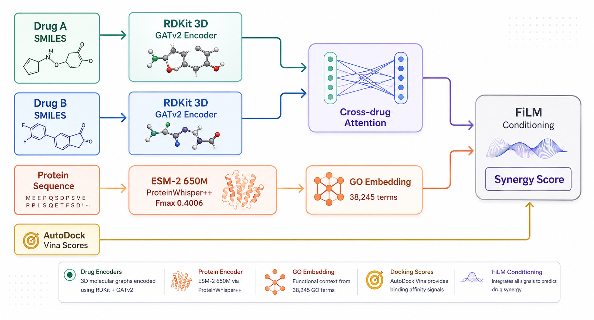

# ProteinSynergyDock

> Predict whether two cancer drugs will work better together — using real molecular docking, graph neural networks, and cancer cell line context, with results exposed as standard healthcare interoperability resources.

**Live demo →** [proteinsynergydock-app-kddtbdmnkixw9c8jfnf8un.streamlit.app](https://proteinsynergydock-app-kddtbdmnkixw9c8jfnf8un.streamlit.app/)
**Live FHIR API →** [proteinsynergydock-fhir-api.onrender.com/docs](https://proteinsynergydock-fhir-api.onrender.com/docs)
**Tests →** 

---

*Vemurafenib (cyan) and Trametinib (orange) docked inside BRAF kinase (PDB: 3OG7). FDA-approved combination for BRAF V600E melanoma.*

---

## The problem

Drug combination screening is expensive. Labs test thousands of pairs in cell culture to find which ones actually synergize. Most computational tools shortcut this by predicting synergy from SMILES strings alone — treating molecules as text, with no sense of where a drug actually sits on its target or what that target does biologically.

Two drugs that bind the same pocket compete, not synergize. Two drugs that bind complementary sites on the same protein, or hit complementary pathways, often do. This geometric and functional context is exactly what most synergy-prediction tools ignore — and it's also where a prediction has to stop being just a number if it's ever going to be useful to anyone outside a research notebook.

## What this does

Give it two drugs, a cancer cell line, and a target protein. It:

1. Fetches the protein crystal structure from RCSB and computes a real binding pocket
2. Runs AutoDock Vina docking for both drugs independently — real pose search, real binding affinities
3. Builds 3D molecular graphs for each drug (RDKit conformer generation → GATv2 graph encoder)
4. Predicts synergy via a cross-drug attention GNN conditioned on cell line identity and GO-derived protein context
5. Quantifies prediction uncertainty using Monte Carlo Dropout (20 stochastic forward passes, Gal & Ghahramani 2016)
6. Renders both docked poses inside the protein in interactive 3D
7. Exposes the result as a spec-compliant **FHIR R4 `DiagnosticReport`** — the same resource format used by EHR platforms like Oracle Health (Cerner) and Epic — both inline in the app and via a public REST API

## Eleven analysis modes, one model

| Tab | What it does |
|---|---|
| 🔬 Predict Synergy | Real-time docking + GNN prediction with uncertainty quantification |
| 🌐 Synergy Landscape | Precomputed 28×28 synergy matrices across 9 cancer panels |
| 📊 Cell Line Comparison | Same drug pair, synergy across different cancer contexts |
| 🏥 Clinical Trials | Live clinical trial search for predicted combinations |
| 📚 Literature | PubMed mining for supporting evidence |
| 💊 Drug Repurposing | Surfaces non-obvious high-synergy pairs |
| ⚙️ Mechanism Explorer | Pathway-level rationale for why a pair should/shouldn't synergize |
| 🧬 Resistance Mutations | Synergy prediction under known resistance mutations (BRAF, EGFR, ALK, BCR-ABL) |
| 🎬 4D Trajectory | Time-evolved docking trajectory visualization |
| 💬 Query | Natural-language interface over precomputed synergy data |
| 🕸️ Polypharmacology Network | Systems-level pathway/drug interaction graph |
| 🏥 Clinical Interop (FHIR) | Converts a live prediction into a FHIR R4 `DiagnosticReport`, with an append-only audit trail |

## Model

**ProteinSynergyDockV2** — GATv2 drug encoder, cross-drug multi-head attention, FiLM-conditioned GO context, learned cell line embeddings (60 NCI-60 lines), ~1.87M parameters.

| Metric | Value |
|---|---|
| Pearson r (held-out) | 0.5667 |
| AUROC | 0.7946 |
| Training data | 107,103 NCI ALMANAC triplets |
| Real docking scores | 842 AutoDock Vina runs across 20 cancer targets |
| Cell lines | 60 (full NCI-60 panel) |

Held-out evaluation methodology and full results: [`heldout_results.json`](heldout_results.json), [`BENCHMARK.md`](BENCHMARK.md).

## Clinical interoperability layer

Most drug-discovery ML projects stop at a prediction number. Real clinical software has to expose that prediction in a format other systems can actually consume, validate inputs against real clinical data shapes instead of trusting arbitrary strings, and keep an auditable record of what was predicted, when, and for whom.

This app implements all three:

- **FHIR R4 resources** (`core_fhir.py`) — predictions are returned as `DiagnosticReport` + `Observation` resources; invalid input returns a spec-correct `OperationOutcome` instead of a stack trace or a silently wrong answer
- **Hash-chained audit log** (`audit_log.py`) — every prediction, successful or rejected, is recorded in an append-only log with cryptographic chaining; `verify_chain()` detects any post-hoc tampering
- **Input validation against real clinical data shapes** — cell line identifiers are checked against the actual NCI-60 nomenclature, not just "is this a non-empty string"
- **Standalone public API** (`api.py`, deployed on Render) — `POST /fhir/DiagnosticReport` runs live model inference and returns FHIR JSON; full interactive docs at [`/docs`](https://proteinsynergydock-fhir-api.onrender.com/docs)

## Examples to try

| Drug A | Drug B | PDB ID | Expected result |
|---|---|---|---|
| Vemurafenib | Trametinib | 3OG7 | ✅ Strongly synergistic (BRAF+MEK, FDA approved) |
| Imatinib | Dasatinib | 2HYY | ❌ Antagonistic (both compete for ABL1 ATP pocket) |
| Erlotinib | Lapatinib | 1IVO | ✅ Synergistic (dual EGFR inhibition) |
| Olaparib | Rucaparib | 4DQY | ⚠️ Mildly synergistic (complementary PARP1 inhibition) |

SMILES for all examples are pre-loaded via the showcase dropdown.

## Engineering

- **266 automated tests** across model logic, chemistry validation, FHIR resource construction, audit log integrity, and the API layer — run on every push via GitHub Actions across Python 3.10 and 3.11
- Business logic separated from UI (`core.py`) so it's testable without a running Streamlit session
- SMILES for all 35+ drugs validated with RDKit on every CI run — no invalid molecules can merge
- Standalone FHIR/API layer (`core_fhir.py`, `audit_log.py`, `model_bridge.py`, `api.py`) with its own test suite, independently deployable from the Streamlit app

## Limitations

This is a research tool, not a clinical diagnostic. Specific known limitations:

- Held-out Pearson r of 0.5667 reflects genuine difficulty in synergy prediction from limited real docking data (842 Vina runs against 107K training triplets) — most synergy is predicted from learned chemical/biological priors, not per-pair docking
- GO embeddings used in the live prediction path are a fixed-size placeholder, not per-protein computed embeddings
- The public FHIR API does not run live AutoDock Vina docking (too slow for a synchronous HTTP request) — `docking_affinity` is omitted from API responses unless explicitly supplied
- Not FDA-reviewed, not validated against real-world clinical outcomes

## Stack

- Docking: AutoDock Vina 1.2.7 + OpenBabel
- Drug encoding: RDKit + PyTorch Geometric (GATv2)
- Interoperability: hand-built FHIR R4 resource construction (no external FHIR SDK dependency), FastAPI
- Visualization: py3Dmol, Plotly
- Frontend: Streamlit
- CI: GitHub Actions (pytest, multi-version matrix)
- API hosting: Render

## Related

- [ProteinSynergyDock](https://github.com/Aprameya05/ProteinSynergyDock) — training code and model weights
- [ProteinWhisper](https://github.com/Aprameya05/ProteinWhisper) — protein function encoder (zero-shot GO annotation)
- [DrugSynergy3D](https://github.com/Aprameya05/DrugSynergy3D) — SE(3)-equivariant synergy prediction
