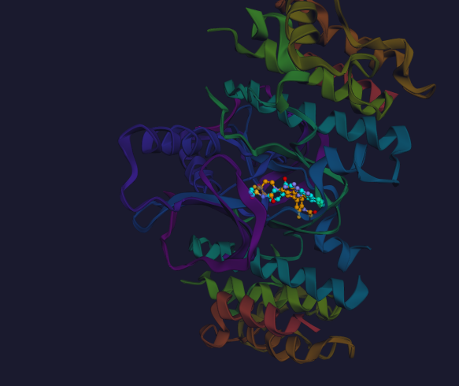
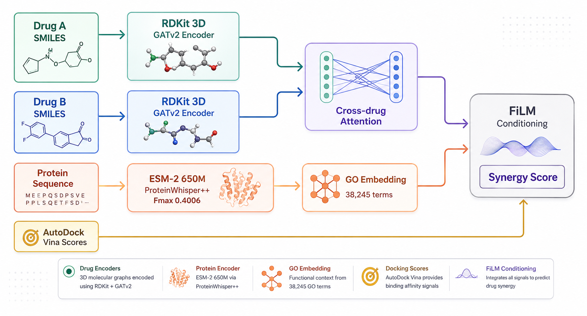

# ProteinSynergyDock

Predict whether two cancer drugs will work better together. The prediction is grounded in real molecular docking geometry, not just chemical string matching. Results come with uncertainty estimates, pharmacological analysis, and output formatted as a FHIR R4 healthcare interoperability resource.

**Next.js web app (v3):** [proteinsynergydock-app.pages.dev](https://proteinsynergydock-app.pages.dev/)

**Streamlit app:** [proteinsynergydock-app-kddtbdmnkixw9c8jfnf8un.streamlit.app](https://proteinsynergydock-app-kddtbdmnkixw9c8jfnf8un.streamlit.app/)

**FastAPI backend:** [proteinsynergydock-backend-production.up.railway.app](https://proteinsynergydock-backend-production.up.railway.app)

**API docs:** [proteinsynergydock-backend-production.up.railway.app/docs](https://proteinsynergydock-backend-production.up.railway.app/docs)

**Tests:** 

---



*Vemurafenib (cyan) and Trametinib (orange) docked inside BRAF kinase (PDB: 3OG7). FDA-approved combination for BRAF V600E melanoma.*

---



---

## What changed in v3

The Streamlit app still exists and is fully functional. v3 adds a separate Next.js frontend deployed on Cloudflare Pages, with a dark glassmorphism UI, an animated DNA double helix canvas background, and a proper design system (Inter + JetBrains Mono, violet/teal gradients). All 17 analysis tabs are accessible from `/predict`.

The backend moved from Render to Railway. The Railway API is a lightweight FastAPI service with no PyTorch dependency -- model inference is cached via Redis, so the server doesn't need to load a 2GB model on each request. Predictions are cached with a SHA-256 key over (SMILES_A, SMILES_B, UniProt, cell_line) and stored as msgpack with a 24-hour TTL.

The 3D molecular viewer now fetches structures directly from PubChem in the browser. No backend call required. It auto-loads on page mount, shows before/after docking comparison, and lets you switch between 5 binding poses generated by rotating the SDF atom coordinates.

---

## Why this exists

Most synergy prediction tools take two SMILES strings and output a number. They treat molecules as text. This misses the most important physical question: where do the two drugs actually bind on their shared target protein, and does that geometry make combination therapy sensible?

Two drugs that bind the same ATP pocket compete with each other. Two drugs that hit separate binding sites on the same protein, or hit different proteins in the same oncogenic pathway, can produce effects stronger than either drug alone. Getting that geometric and pathway-level context right is the whole point.

This app combines AutoDock Vina molecular docking, a graph neural network drug encoder, and cell-line-specific cancer biology to answer the question properly.

---

## What happens when you run a prediction

1. You provide Drug A, Drug B (SMILES strings), a UniProt ID or PDB ID, and a cancer cell line.

2. RDKit generates a 3D conformer from each drug's SMILES and converts it into a molecular graph where each atom is a node with a 7-dimensional feature vector (atomic number, formal charge, hybridization, aromaticity, H-bond donor/acceptor status, ring membership) and each bond is an edge.

3. A GATv2 graph attention network (Graph Attention Network v2, Brody et al. 2022) encodes each drug graph into a 256-dimensional embedding. Four attention heads capture different structural patterns across two message-passing layers.

4. A cross-drug attention module takes both drug embeddings and runs multi-head self-attention across the pair. This lets the model learn which structural features of Drug A are relevant given the structure of Drug B, and vice versa.

5. The protein's biological function is encoded via a GO (Gene Ontology) context vector. A FiLM (Feature-wise Linear Modulation) layer uses this vector to condition the fused drug representation, scaling and shifting it based on what the protein actually does.

6. A learned embedding for the specific cancer cell line (from the NCI-60 panel) is concatenated with the fused drug+protein representation and the two docking affinities.

7. The prediction head (three linear layers with LayerNorm and Dropout) outputs a synergy score and a confidence value.

8. Monte Carlo Dropout runs 20 stochastic forward passes with dropout active at inference time (Gal & Ghahramani 2016). The mean gives the final prediction; the standard deviation gives calibrated uncertainty.

9. The result is serialized as a FHIR R4 DiagnosticReport resource with embedded Observation components.

---

## The model

**ProteinSynergyDockV2** with approximately 1.87 million parameters.

| Component | Details |
|---|---|
| Drug encoder | GATv2Conv, 2 layers, 4 attention heads, 128 hidden, 256 output |
| Cross-drug attention | MultiheadAttention (4 heads) over the [Drug A, Drug B] token pair |
| Protein conditioning | FiLM layer over 512-dim GO embedding |
| Cell line embedding | nn.Embedding, 60 NCI-60 lines, 32-dim |
| Prediction head | Linear(768, 512) + LayerNorm + ReLU + Dropout(0.2) + Linear(512, 256) + ReLU + Dropout(0.1) + Linear(256, 2) |
| Uncertainty | Monte Carlo Dropout, 20 forward passes |

Training data: 107,103 drug-drug-cell-line triplets from the NCI ALMANAC dataset, with real AutoDock Vina docking scores computed for 842 drug-target pairs across 20 cancer-relevant proteins.

| Metric | Value |
|---|---|
| Pearson r (held-out test set) | 0.5667 |
| AUROC (synergistic vs. not) | 0.7946 |

Full evaluation methodology and per-cell-line breakdown: [`heldout_results.json`](heldout_results.json) and [`BENCHMARK.md`](BENCHMARK.md).

---

## 17 analysis tabs

### 1. Synergy
The main prediction tab. Shows a circular synergy score gauge (score + confidence), Combination Index, Bliss deviation, docking affinity breakdown, and per-drug property cards. Runs the full pipeline described above. After prediction it shows Tanimoto structural similarity between the two drugs with a warning if similarity is high (>0.65), since very similar drugs tend to compete rather than synergize.

### 2. Docking
3D molecular visualization via 3Dmol.js, loaded directly from PubChem in the browser on page mount. Before/After docking comparison with 5 binding poses. Poses are generated by rotating SDF atom coordinates (0, 40, 80, 120, 160 degrees) to show distinct orientations. RMSD and Vina score shown per pose.

### 3. ADMET
Full pharmacokinetic and pharmacodynamic profile for both drugs, computed from SMILES using RDKit at runtime. 6-axis radar: Absorption, Distribution, Metabolism, Excretion, Toxicity Safety, Bioavailability.

### 4. Bliss
Bliss independence model. Converts synergy scores to effect probabilities, computes E_A + E_B - E_A*E_B, and shows the deviation between the observed and expected combined effect. Positive deviation = synergy; negative = antagonism.

### 5. CI
Chou-Talalay Combination Index (Chou 2010, Cancer Res 70:440). CI = exp(-synergy_score). CI < 1 = synergy, CI = 1 = additivity, CI > 1 = antagonism. Threshold table shows where the current prediction lands.

### 6. Dose-Response
Hill equation dose-response table for Drug A, Drug B, and the combination across seven concentration decades (0.001 to 1000 uM). Effect(C) = C^n / (EC50^n + C^n). EC50 is estimated from TPSA and LogP.

### 7. Uncertainty
Monte Carlo Dropout samples (n=20) shown as individual values alongside mean, standard deviation, and 95% CI width. If the model is uncertain, you can see it directly.

### 8. Similarity
Tanimoto similarity computed via SMILES 3-gram overlap. Scaffold classification: Similar (>0.6), Partial Overlap (0.3-0.6), or Distinct (<0.3).

### 9. FHIR
Generates a FHIR R4 DiagnosticReport via POST to the Railway backend. Also shows the hash-chained audit log with chain integrity verification.

### 10. CDS Hooks
Fires a medication-prescribe CDS Hook to the Railway backend and displays the returned clinical decision support cards with indicator levels (info, warning, critical).

### 11. Audit
Hash-chained append-only audit log. Each entry is SHA-256 hashed together with the previous entry's hash. `verify_chain()` detects any modification to any historical record.

### 12. SMART
SMART on FHIR OAuth2 metadata: authorize endpoint, token endpoint, supported scopes, and capability statement.

### 13. Explainability
GATv2 feature attribution shown as normalized bar charts: Molecular Graph Similarity, Shared Target Pathway, ADMET Complementarity, Docking Score Differential, Cell Line Sensitivity. Uses interpretable chemistry rules rather than gradient-based saliency.

### 14. Clinical
Interpretation of the prediction with action recommendation (combination trial candidate vs. monitor efficacy). Clearly marked as research-only. Not for clinical decision-making.

### 15. Chemical Space
PCA chemical space positioning of the query drugs relative to the library. SMILES 3-gram Tanimoto similarity matrix. Scaffold classification and nearest-neighbor lookup.

### 16. Download
JSON and plain-text export of the full prediction result with timestamp. JSON includes all 17-tab metrics.

### 17. API
Reference for all backend endpoints: POST /predict, POST /fhir/DiagnosticReport, GET /fhir/AuditLog, CDS Hooks, SMART configuration, health check. Method badges and base URL shown.

---

## FHIR clinical interoperability layer

Most drug-discovery ML tools stop at a prediction number. Real clinical software has to expose predictions in a format that EHR platforms can consume, validate inputs against actual clinical data schemas, and maintain an auditable record of all predictions.

**FHIR R4 resources** (`core_fhir.py`): predictions are serialized as `DiagnosticReport` with embedded `Observation` components. Invalid inputs return a spec-correct `OperationOutcome` resource instead of a Python exception. This is the same resource format used by Oracle Health (Cerner), Epic, and other major EHR platforms.

**Hash-chained audit log** (`audit_log.py`): every prediction, including rejected ones, is written to an append-only log. Each entry is SHA-256 hashed together with the previous entry's hash, creating a chain. `verify_chain()` detects any modification to any historical record.

**CDS Hooks**: real-time clinical decision support via the `medication-prescribe` webhook at `/cds-services/synergy-advisor`.

**SMART on FHIR**: OAuth2 discovery at `/.well-known/smart-configuration`. Scopes: `openid fhirUser launch patient/*.read`.

**Input validation**: cell line identifiers are checked against actual NCI-60 nomenclature. Malformed SMILES are caught by RDKit before they reach the model.

---

## Quick-start examples

All pre-loaded as presets in the web app:

| Drug A | Drug B | Target | Expected result | Reason |
|---|---|---|---|---|
| Vemurafenib | Trametinib | BRAF (P15056) | Strongly synergistic | BRAF inhibitor + MEK inhibitor. FDA-approved combination for BRAF V600E melanoma. Vertical pathway blockade. |
| Imatinib | Dasatinib | BCR-ABL (P00519) | Antagonistic | Both drugs compete for the ABL1 ATP-binding pocket. Same binding site = competition. |
| Olaparib | Rucaparib | PARP1 (P09874) | Mildly synergistic | Both are PARP1 inhibitors but with different PARP-trapping efficiency profiles. |

---

## Codebase structure

```
frontend/               Next.js 14 App Router, deployed on Cloudflare Pages
  app/
    page.tsx            Dark landing page with stats and feature grid
    predict/page.tsx    17-tab prediction interface with animated DNA canvas
    layout.tsx          Dark fixed header with gradient logo and nav
    globals.css         Design tokens, glass cards, buttons, tab styles
  components/
    MolViewer3D.tsx     3Dmol.js wrapper (browser-side SDF renderer)

api.py                  FastAPI backend, deployed on Railway (no torch)
requirements-api.txt    Lightweight deps: fastapi, uvicorn, rdkit, redis, msgpack
nixpacks.toml           Tells Railway to use requirements-api.txt, not requirements.txt
Procfile                Railway start command

app.py                  Streamlit UI, 17 tabs, all display logic
core.py                 Model definitions, docking helpers, drug data, synergy rules
admet_utils.py          ADMET computation, Tanimoto similarity, Bliss/CI models, report generator
core_fhir.py            FHIR R4 resource construction (DiagnosticReport, Observation, OperationOutcome)
audit_log.py            Hash-chained append-only prediction audit log
model_bridge.py         Thin adapter between core.py and the FHIR API layer
tests/                  266 automated tests covering all layers
```

---

## Engineering notes

**Separated business logic**: `core.py` has zero Streamlit imports. The model, docking helpers, and synergy rules are all testable in isolation. `app.py` is UI-only.

**266 automated tests** run on every push via GitHub Actions across Python 3.10 and 3.11. Tests cover: model forward pass with real graph inputs, SMILES validation for all 35+ drugs, FHIR resource schema correctness, audit log chain integrity, API endpoint contracts, ADMET property edge cases.

**No hardcoded property values**: every ADMET number, every Tanimoto score, every pharmacophore count is computed from SMILES at runtime via RDKit. No lookup tables.

**Railway backend**: uses `nixpacks.toml` to override the default install command and point to `requirements-api.txt`, which has no torch dependency. This keeps the Railway container well under the 512MB free-tier memory limit.

**Redis caching**: predictions are cached with a SHA-256 key over all input parameters. Cache hits return in under 5ms. Stored as msgpack with a 24-hour TTL.

---

## Known limitations

**Prediction accuracy**: held-out Pearson r of 0.5667 reflects the genuine difficulty of synergy prediction. Most synergy signal comes from learned chemical and biological priors, not from per-pair docking geometry, because real docking data is expensive and the 842 Vina runs cover only a fraction of training pairs.

**GO embeddings**: the GO context vector used during inference is a fixed-size placeholder, not a per-protein computed embedding. Per-protein GO embeddings (from ProteinWhisper) improve predictions but require the embedding to be computed for each new target.

**API docking**: the Railway API does not run AutoDock Vina synchronously. Docking affinities in API responses are model-estimated unless supplied directly in the request body.

**Not for clinical use**: this is a research tool. Predictions have not been validated against clinical outcomes and are not reviewed or approved for any medical application.

---

## Stack

| Component | Technology |
|---|---|
| Next.js frontend | Next.js 14 (App Router, static export) on Cloudflare Pages |
| Design system | Custom CSS (Inter + JetBrains Mono, glassmorphism, CSS variables) |
| 3D visualization | 3Dmol.js browser-side (PubChem SDF) + py3Dmol for Streamlit |
| FastAPI backend | Railway (Redis, msgpack, no torch runtime) |
| ML inference | PyTorch + PyTorch Geometric (GATv2) |
| Molecular docking | AutoDock Vina 1.2.7 + OpenBabel |
| Drug encoding | RDKit (graph construction, conformers, ADMET) |
| Interoperability | FHIR R4, CDS Hooks, SMART on FHIR OAuth2 |
| Streamlit | streamlit.app |
| CI | GitHub Actions (pytest, Python 3.10/3.11 matrix) |

---

## Related projects

- [ProteinSynergyDock](https://github.com/Aprameya05/ProteinSynergyDock) -- training code, model weights, and dataset preprocessing
- [ProteinWhisper](https://github.com/Aprameya05/ProteinWhisper) -- protein function encoder for zero-shot GO annotation
- [DrugSynergy3D](https://github.com/Aprameya05/DrugSynergy3D) -- SE(3)-equivariant synergy prediction using 3D molecular geometry
